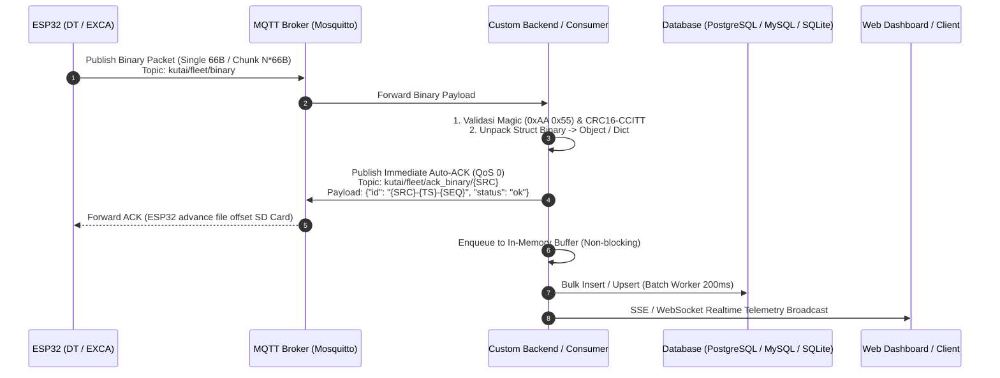

# 📘 Dokumentasi Integrasi Backend & MQTT Binary Suite (GPS Tambang Edge)

Dokumen ini ditujukan untuk **Backend Developer / Engineering Team** yang ingin mengintegrasikan layanan backend mereka sendiri dengan armada ESP32 GPS Tambang (Dump Truck / Excavator Binary Edition).

---

## 1. Arsitektur Komunikasi & Alur Data



---

## 2. Spesifikasi Broker MQTT & Topic

### Parameter Broker
* **Host Broker**: `34.101.180.48` (atau host broker internal Anda)
* **Port**: `1883` (TCP murni)
* **Username**: `kutai`
* **Password**: `79750d76450466d56b9f44926f38614a3846bdbf`

### Topic Channels

| Arah | Topic | Format Payload | Penjelasan |
| :--- | :--- | :--- | :--- |
| **ESP32 ➔ Backend** | `kutai/fleet/binary` | **Raw Bytes** (Kelipatan 66 Bytes) | Berisi 1 rekaman telemetri (66B) atau bulk chunk (misal: 16 rekaman = $16 \times 66 = 1056$ Bytes). |
| **Backend ➔ ESP32** | `kutai/fleet/ack_binary/{SRC}` | **JSON Text** (QoS 0) | Format ACK wajib ke ESP32 agar offset Micro SD bertambah. Contoh: `kutai/fleet/ack_binary/DT01`. |
| **Backend ➔ ESP32 (Legacy)** | `kutai/fleet/ack/{SRC}` | **JSON Text** (QoS 0) | Topic ACK fallback untuk backward compatibility. |

---

## 3. Format Struct Binary (66 Bytes Exact)

Ukuran struct pada ESP32 adalah **tepat 66 Bytes** dengan memori berurutan (Packing 1 Byte, Little-Endian).

### Layout Memori Paket

| Offset | Field Name | Tipe Data | Size | Skala / Konversi | Keterangan |
| :---: | :--- | :--- | :---: | :--- | :--- |
| `0..1` | `magic` | `uint8_t[2]` | 2B | `0xAA, 0x55` | Sync Marker penanda awal paket. |
| `2` | `version` | `uint8_t` | 1B | Nilai: `2` | Protocol Version (Versi 2 aktif saat ini). |
| `3..10` | `src` | `char[8]` | 8B | ASCII string | ID Armada (contoh: `"DT01\0\0\0\0"` atau `"EXCA01\0"`). |
| `11..18`| `imei` | `uint64_t` | 8B | Integer 64-bit | 15-digit IMEI GPS Tracker (contoh: `861327085563067`). |
| `19..22`| `seq` | `uint32_t` | 4B | Counter integer | Nomor urut paket dari ESP32 (monotonik naik). |
| `23..26`| `timestamp` | `uint32_t` | 4B | Unix Epoch UTC | Detik sejak Jan 01 1970 UTC (contoh: `1775738126`). |
| `27..30`| `lat_x1e7` | `int32_t` | 4B | `nilai / 10,000,000.0` | Latitude GPS (contoh: `-7388810` ➔ `-0.7388810`). |
| `31..34`| `lon_x1e7` | `int32_t` | 4B | `nilai / 10,000,000.0` | Longitude GPS (contoh: `1171301520` ➔ `117.1301520`). |
| `35..36`| `speed_x10` | `uint16_t` | 2B | `nilai / 10.0` | Kecepatan km/jam (contoh: `250` ➔ `25.0` km/jam). |
| `37..38`| `heading` | `uint16_t` | 2B | Derajat ($0^\circ - 360^\circ$) | Arah hadap kendaraan. |
| `39..40`| `altitude` | `int16_t` | 2B | Meter dpl | Ketinggian dpl ($-32768 .. +32767$). |
| `41..42`| `bat_mv` | `uint16_t` | 2B | `nilai / 1000.0` (Volt) | Tegangan Aki / Eksternal (contoh: `24500` ➔ `24.50` V). |
| `43` | `ignition` | `uint8_t` | 1B | `1` = ON, `0` = OFF | Status kontak / ACC. |
| `44` | `input_status`| `uint8_t` | 1B | Bitmask | Bit 0: PTO Bak Dump Truck (`1`=Dump/Naik, `0`=Turun). |
| `45` | `flags` | `uint8_t` | 1B | Bitmask | Bit 0: GPS Fix valid (`1`), Bit 1: Data relay EXCA (`1`). |
| `46..51`| `beacon_mac` | `uint8_t[6]` | 6B | Format MAC hex | MAC address Bluetooth Beacon terdekat (`AA:BB:CC:DD:EE:FF`). |
| `52` | `beacon_rssi`| `int8_t` | 1B | dBm (Signed) | Kekuatan sinyal beacon (contoh: `-67` dBm). |
| `53..56`| `ibutton_id` | `uint32_t` | 4B | Hex string 8-char | Driver RFID iButton (contoh: `0x010A0D09` ➔ `"010A0D09"`). |
| `57` | `ibutton_flags`|`uint8_t` | 1B | Bitmask | Bit 0: Status (`1`=login, `0`=logout), Bit 1: Auth (`1`=OK). |
| `58..59`| `gs_x` | `int16_t` | 2B | Milli-g | G-Sensor accelerometer sumbu X. |
| `60..61`| `gs_y` | `int16_t` | 2B | Milli-g | G-Sensor accelerometer sumbu Y. |
| `62..63`| `gs_z` | `int16_t` | 2B | Milli-g | G-Sensor accelerometer sumbu Z. |
| `64..65`| `crc16` | `uint16_t` | 2B | CRC16-CCITT | Checksum atas **64 byte pertama** (`offset 0..63`). |

### Formula Format Unpack Python `struct`
```python
TELEMETRY_STRUCT_FMT_V2 = "<2sB8sQIIiiHHhHBBB6sbIBhhhH"
TELEMETRY_PACKET_SIZE = 66
```

---

## 4. Mekanisme Handshake ACK (Sangat Penting!)

ESP32 menggunakan strategi **Store-and-Forward**:
1. ESP32 mencatat data ke Micro SD.
2. Ketika konek ke WiFi/Internet, ESP32 mengirim data (bisa batch s/d 16 paket).
3. ESP32 **menunggu ACK** sebelum memajukan offset baca di Micro SD.
4. Jika ACK tidak diterima dalam waktu 2–3 detik, ESP32 menganggap pengiriman gagal dan akan mengulang (retry) pengiriman paket yang sama.

### Cara Memberikan Respon ACK yang Benar

Begitu Backend selesai mem-parse payload (atau menaruhnya di memory queue):
1. Ambil rekaman **terakhir** dari batch payload.
2. Bentuk string Unique ID:
   $$\text{Unique ID} = \texttt{"\{src\}-\{timestamp\}-\{seq\}"}$$
   Contoh: `"DT01-1775738126-1045"`
3. Buat payload JSON:
   ```json
   {
     "id": "DT01-1775738126-1045",
     "count": 1,
     "status": "ok"
   }
   ```
4. Publish ke MQTT dengan **QoS 0**:
   - Topic utama: `kutai/fleet/ack_binary/{SRC}` (contoh: `kutai/fleet/ack_binary/DT01`)
   - Topic kompatibilitas: `kutai/fleet/ack/{SRC}`

> **TIPS HIGH-PERFORMANCE:**
> Kirimkan ACK **segera di thread MQTT callback**, jangan tunggu query database selesai menulis ke disk (`Producer-Consumer Queue Pattern`). Dengan cara ini throughput dapat menembus > 2.000 record/detik tanpa timeout pada ESP32.

---

## 5. Algoritma Validasi CRC16-CCITT

Sebelum data disimpan, validasi bahwa byte tidak korup di jaringan menggunakan algoritma CRC16-CCITT (Polinomial `0x1021`, Initial `0xFFFF`):

### Implementasi Python
```python
def calculate_crc16(data: bytes) -> int:
    crc = 0xFFFF
    for byte in data:
        crc ^= (byte << 8)
        for _ in range(8):
            if crc & 0x8000:
                crc = ((crc << 1) ^ 0x1021) & 0xFFFF
            else:
                crc = (crc << 1) & 0xFFFF
    return crc
```

### Implementasi Node.js (TypeScript)
```typescript
function calculateCRC16(buffer: Buffer, length: number): number {
  let crc = 0xFFFF;
  for (let i = 0; i < length; i++) {
    crc ^= (buffer[i] << 8);
    for (let j = 0; j < 8; j++) {
      if (crc & 0x8000) {
        crc = ((crc << 1) ^ 0x1021) & 0xFFFF;
      } else {
        crc = (crc << 1) & 0xFFFF;
      }
    }
  }
  return crc;
}
```

---

## 6. Contoh Kode Referensi Backend (Python)

Berikut adalah skeleton backend lengkap siap pakai untuk developer baru:

```python
import struct
import json
import time
from datetime import datetime, timezone
import paho.mqtt.client as mqtt

TELEMETRY_PACKET_SIZE = 66
TELEMETRY_STRUCT_FMT_V2 = "<2sB8sQIIiiHHhHBBB6sbIBhhhH"

def calculate_crc16(data: bytes) -> int:
    crc = 0xFFFF
    for byte in data:
        crc ^= (byte << 8)
        for _ in range(8):
            if crc & 0x8000:
                crc = ((crc << 1) ^ 0x1021) & 0xFFFF
            else:
                crc = (crc << 1) & 0xFFFF
    return crc

def parse_packet(raw_bytes: bytes):
    if len(raw_bytes) != TELEMETRY_PACKET_SIZE or raw_bytes[:2] != b'\xaa\x55':
        return None
    
    received_crc = struct.unpack("<H", raw_bytes[64:66])[0]
    if calculate_crc16(raw_bytes[:64]) != received_crc:
        return None  # Checksum mismatch!

    fields = struct.unpack(TELEMETRY_STRUCT_FMT_V2, raw_bytes)
    src = fields[2].decode('ascii', errors='ignore').rstrip('\x00').strip()
    imei_num = fields[3]
    seq = fields[4]
    ts_sec = fields[5]
    lat = fields[6] / 1e7
    lon = fields[7] / 1e7
    speed = fields[8] / 10.0
    heading = fields[9]
    altitude = fields[10]
    bat_v = fields[11] / 1000.0
    ign = fields[12]
    pto = 1 if (fields[13] & 0x01) else 0
    flags = fields[14]
    
    # Beacon MAC & RSSI
    mac_bytes = fields[15]
    beacon_mac = ":".join(f"{b:02X}" for b in mac_bytes) if any(b != 0 for b in mac_bytes) else ""
    beacon_rssi = fields[16]
    
    # iButton
    ibutton_id = fields[17]
    ibutton_flags = fields[18]
    ibutton_hex = f"{ibutton_id:08X}" if ibutton_id > 0 else ""
    ibutton_login = bool(ibutton_flags & 0x01)
    
    # G-Sensor
    gs_x, gs_y, gs_z = fields[19], fields[20], fields[21]

    return {
        "id": f"{src}-{ts_sec}-{seq}",
        "src": src,
        "imei": str(imei_num),
        "seq": seq,
        "ts": datetime.fromtimestamp(ts_sec, tz=timezone.utc).isoformat(),
        "timestamp_sec": ts_sec,
        "lat": lat,
        "lon": lon,
        "speed": speed,
        "heading": heading,
        "altitude": altitude,
        "bat": bat_v,
        "ign": ign,
        "pto": pto,
        "ibutton": ibutton_hex,
        "ibutton_login": ibutton_login,
        "gs": {"x": gs_x, "y": gs_y, "z": gs_z},
        "beacon_mac": beacon_mac,
        "beacon_rssi": beacon_rssi
    }

def on_message(client, userdata, msg):
    if msg.topic == "kutai/fleet/binary":
        payload = msg.payload
        num_packets = len(payload) // TELEMETRY_PACKET_SIZE
        parsed_records = []
        
        for i in range(num_packets):
            chunk = payload[i * TELEMETRY_PACKET_SIZE : (i + 1) * TELEMETRY_PACKET_SIZE]
            record = parse_packet(chunk)
            if record:
                parsed_records.append(record)
        
        if parsed_records:
            # 1. Segera kirim ACK atas rekaman terakhir
            last_rec = parsed_records[-1]
            ack_msg = json.dumps({
                "id": last_rec["id"],
                "count": len(parsed_records),
                "status": "ok"
            })
            client.publish(f"kutai/fleet/ack_binary/{last_rec['src']}", ack_msg, qos=0)
            client.publish(f"kutai/fleet/ack/{last_rec['src']}", ack_msg, qos=0)
            
            # 2. Simpan ke database (atau masukkan ke internal Queue)
            # db.save_bulk(parsed_records)
            print(f"✅ Ingested {len(parsed_records)} records from {last_rec['src']} (Last ID: {last_rec['id']})")

client = mqtt.Client()
client.username_pw_set("kutai", "79750d76450466d56b9f44926f38614a3846bdbf")
client.on_connect = lambda c, u, f, rc: c.subscribe("kutai/fleet/binary")
client.on_message = on_message
client.connect("34.101.180.48", 1883, 60)
client.loop_forever()
```

---

## 7. Skema Database Rekomendasi (PostgreSQL / MySQL)

Jika menggunakan RDBMS, berikut skema tabel yang direkomendasikan dengan indeks teroptimasi untuk fleet tracking:

```sql
CREATE TABLE telemetry (
    id VARCHAR(64) PRIMARY KEY,               -- e.g. 'DT01-1775738126-1045'
    src VARCHAR(16) NOT NULL,                 -- e.g. 'DT01', 'EXCA01'
    imei VARCHAR(20),                         -- e.g. '861327085563067'
    seq BIGINT NOT NULL,
    timestamp_sec BIGINT NOT NULL,
    ts TIMESTAMP WITH TIME ZONE NOT NULL,
    lat DOUBLE PRECISION NOT NULL,
    lon DOUBLE PRECISION NOT NULL,
    speed NUMERIC(5, 1) DEFAULT 0.0,
    heading INT DEFAULT 0,
    altitude INT DEFAULT 0,
    bat NUMERIC(4, 2) DEFAULT 0.0,            -- in Volts
    ign SMALLINT DEFAULT 0,                   -- 1: ON, 0: OFF
    pto SMALLINT DEFAULT 0,                   -- 1: Bak Dump Naik, 0: Turun
    ibutton VARCHAR(32),                      -- RFID Driver
    ibutton_status VARCHAR(16),               -- 'login' / 'logout'
    gs_x INT DEFAULT 0,
    gs_y INT DEFAULT 0,
    gs_z INT DEFAULT 0,
    beacon_mac VARCHAR(32),
    beacon_rssi SMALLINT,
    raw_json TEXT,
    created_at TIMESTAMP WITH TIME ZONE DEFAULT CURRENT_TIMESTAMP
);

-- Indeks performa query peta dan histori
CREATE INDEX idx_telemetry_src ON telemetry(src);
CREATE INDEX idx_telemetry_imei ON telemetry(imei);
CREATE INDEX idx_telemetry_ts ON telemetry(ts DESC);
CREATE INDEX idx_telemetry_ts_sec ON telemetry(timestamp_sec DESC);
CREATE INDEX idx_telemetry_src_ts ON telemetry(src, timestamp_sec DESC);
```

---

## 8. Ringkasan Checklist untuk Backend Baru

- [ ] Konek ke MQTT Broker `34.101.180.48:1883` dengan kredensial `kutai`.
- [ ] Subscribe ke topic `kutai/fleet/binary`.
- [ ] Validasi byte sync marker (`0xAA 0x55`) dan checksum CRC16-CCITT (64 bytes pertama).
- [ ] Unpack per kelipatan **66 Bytes** menggunakan layout Little-Endian.
- [ ] Kirim Auto-ACK ke topic `kutai/fleet/ack_binary/{SRC}` dengan payload `{"id": "{SRC}-{TS}-{SEQ}", "status": "ok"}` segera setelah menerima data.
- [ ] Simpan ke database dengan Unique Key `id` (`INSERT ... ON CONFLICT DO UPDATE / REPLACE`).
